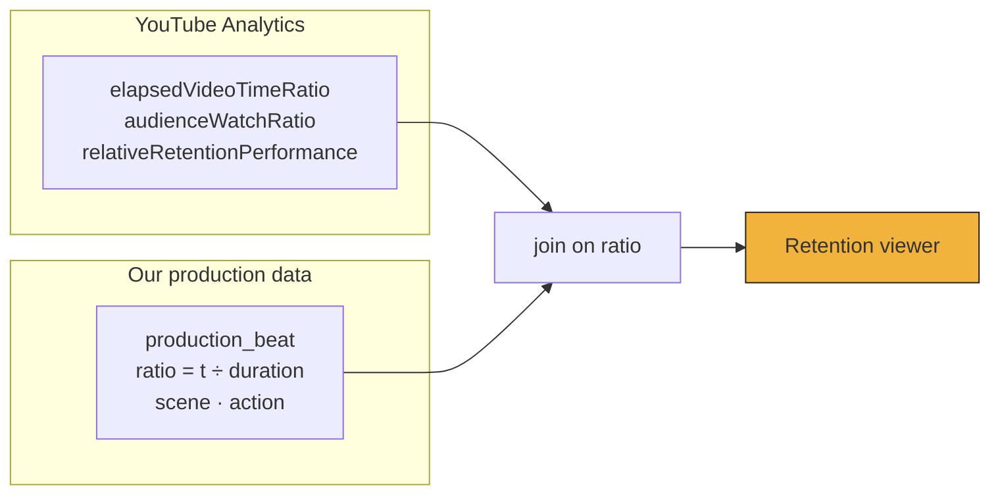

# Analytics Architecture

Verified working: an authorised `reports.query` returned
`views, engagedViews, estimatedMinutesWatched, averageViewDuration, averageViewPercentage,
likes, shares, subscribersGained` for the last 28 days. The channel has no videos, so the row
is zeros — that is `NO DATA YET`, not a failure.

---

## Shorts metric semantics — the thing most dashboards get wrong

Since **21 July 2025**, for Shorts:

| Metric | Means | Do not… |
|---|---|---|
| **`views`** | every time the Short **starts or replays**. No minimum watch time. | …call this "people who watched" |
| **`engagedViews`** | views that continued **past the initial seconds** | …call this "views" |

They are different numbers measuring different things, and for a looping Short the gap
between them is large and *informative*: a high `views` with low `engagedViews` means the
thumbnail/hook is pulling people who immediately leave.

**Rules enforced by the architecture:**

- separate columns in `daily_video_metric`; never one derived from the other
- both always displayed together, never one substituted for the other
- every surface carries help text stating the definition
- the July 2025 change means **pre- and post-change figures are not comparable**; any chart
  crossing that boundary must say so

## Report definitions, not string concatenation

YouTube Analytics rejects invalid metric/dimension pairings. A UI that lets a user type
metric names produces confusing 400s.

So queries come from a **fixed catalogue** of named, validated report definitions:

| Definition | Dimensions | Metrics | Use |
|---|---|---|---|
| `channel.daily` | `day` | views, engagedViews, minutes, avgDuration, avgPercentage, likes, comments, shares, subsGained, subsLost | dashboard trend |
| `video.daily` | `day` + filter `video==ID` | same | video detail |
| `video.lifetime` | — + filter `video==ID` | same | headline figures |
| `video.retention` | `elapsedVideoTimeRatio` + filter `video==ID` | audienceWatchRatio, relativeRetentionPerformance | the retention curve |
| `video.traffic` | `insightTrafficSourceType` + filter `video==ID` | views, estimatedMinutesWatched | discovery mix |
| `channel.geography` | `country` | views, estimatedMinutesWatched | later |
| `video.subscribedStatus` | `subscribedStatus` | views, avgViewPercentage | subscriber vs not |

Each definition declares its dimensions, metrics, allowed filters and minimum date range, and
is validated locally before the request goes out. Adding a report is adding a definition —
never a new call site.

---

## The retention overlay

The reason this system is worth building.

YouTube returns ~100 points of `audienceWatchRatio` against `elapsedVideoTimeRatio` (0→1).
We own `storyboard.json`, so we know what was happening at every moment. Join them.



`production_beat.ratio` is precomputed at ingest precisely so this is a join, not arithmetic
at query time.

What it produces:

```
100% ┤━━━━━━━━━━┓
     │           ┗━━━━━━━━┓
 60% ┤                    ┗━━━━━━━━━━━━━┓
     │                                   ┗━━━━━━━
  0% ┼────┬──────┬─────────┬──────┬──────┬───────
     0%   9%    31%       57%    78%    100%
     HOOK  │   MECHANISM   │    PAYOFF   LOOP
      "A HOLE?"      "BREATHER HOLE"  "LOAD-BEARING"
```

Now "viewers leave at 57%" becomes **"they leave when the mechanism diagram appears"** — a
statement about a creative decision, which is actionable. That is the bridge from analytics
back to production, and no off-the-shelf tool can build it because no off-the-shelf tool has
our storyboard.

**The curve is never altered.** Production annotations are a separate overlay layer. We do
not smooth, normalise or "correct" YouTube's numbers.

`relativeRetentionPerformance` (0–1, versus YouTube videos of similar length) is the honest
cross-video comparator — far better than comparing raw curves between a 28s and a 34s Short.

---

## Snapshots

Captured at **1h · 6h · 24h · 72h · 7d** after publication.

Each `analytics_snapshot` stores:

| Field | Why |
|---|---|
| `requested_at` | when we asked |
| **`data_end_date`** | how far YouTube's data actually runs |
| `availability` | `OK` · `PARTIAL` · `NOT_READY` |
| `metrics_json` | the figures |

**Analytics data lags.** A "24h" snapshot whose `data_end_date` is yesterday is not a final
24-hour number, and the UI must say so rather than imply precision. Snapshots are therefore
**refreshable**: a later re-fetch supersedes an earlier one and both are kept, so the
reporting delay is visible instead of hidden.

Never present an early snapshot as final. Early Shorts numbers move a lot.

---

## Traffic sources

`insightTrafficSourceType` gives values such as `SHORTS`, `YT_SEARCH`, `BROWSE`,
`RELATED_VIDEO`, `EXT_URL`, `PLAYLIST`, `CHANNEL`, `NOTIFICATION`.

Capability status:

| Signal | Status |
|---|---|
| Shorts feed as a traffic source | **UNKNOWN — requires validation** against real data once published |
| Search / Browse / Suggested / External / Playlist | **AVAILABLE** via Analytics API |
| Impressions & impression CTR | **NOT AVAILABLE** through any API — Studio only |
| Sound page / hashtag page attribution | **UNKNOWN — requires validation** |

Anything marked UNKNOWN stays UNKNOWN in the UI until a real query proves it. We do not
guess, and we do not scrape Studio to fill the gap.

---

## Reporting API — not yet

| | YouTube Analytics API | YouTube Reporting API |
|---|---|---|
| Shape | targeted, interactive queries | scheduled bulk CSV |
| Freshness | on demand | daily, with lag |
| Setup | none | create jobs, poll, download, parse |
| Best for | tens of videos | large historical corpora |

**Recommendation: skip until ~100+ videos.** For 10–30 videos the targeted API is simpler,
fresher and sufficient. Revisit when per-video daily backfill starts straining the request
budget, or when multi-year history is wanted.

---

## Design boundary: owner analytics vs public research

These are kept **conceptually and physically separate** — different modules, different
tables, different UI sections.

- **Owner analytics** — `yt-analytics.readonly`, our channel, authoritative.
- **Public research** — `search.list` and public `videos.list`, other people's channels,
  capped at 100 search calls/day.

They are never blended into a single derived score. See
[API_POLICY_AND_LIMITS.md](./API_POLICY_AND_LIMITS.md) for why that boundary is a policy
matter and not merely a design preference.
