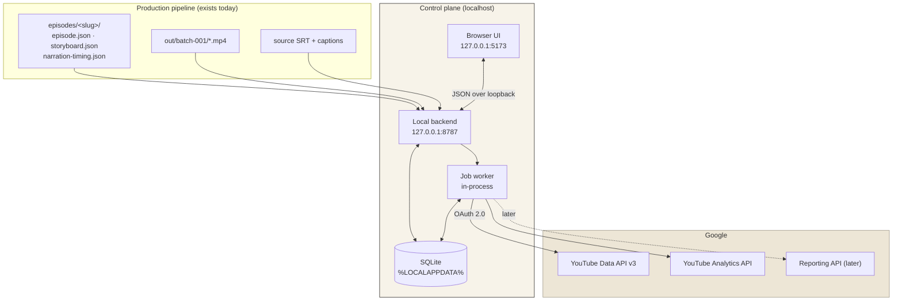
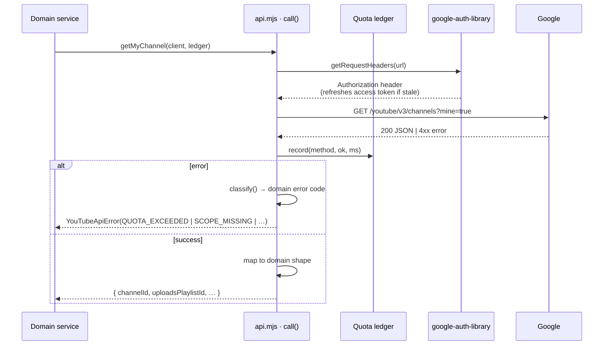
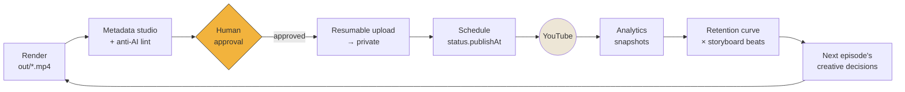

# Architecture — the Bill Finds Out local control plane

A single-user, localhost-only operating system for one YouTube channel. Production assets go
in; controlled publication goes out; official analytics come back and attach themselves to
the exact creative decisions that produced each video.

It is not a SaaS, and it is not an uploader script.

---

## Principles

1. **Local only.** Binds `127.0.0.1`. No cloud, no hosted database, no telemetry, no remote
   admin surface. The only outbound traffic is to Google's APIs.
2. **The browser never holds a secret.** The client secret and refresh token live behind the
   local backend. The UI talks to the backend; only the backend talks to Google.
3. **Google shapes stay behind adapters.** Domain code never sees a raw API response type.
   This is what makes `videos.batchGetStats` — an endpoint three months old — a one-file
   change rather than a refactor.
4. **Writes are gated by explicit human approval.** An approval authorises *one exact job*,
   not a policy.
5. **Simple enough for one person to run.** One backend, one frontend, one SQLite file, one
   worker. No queue broker, no container orchestration, no microservices.

---

## Shape



The secret boundary is the `API` box. Nothing to its left ever receives a token.

---

## Module layout

Follows the repository's existing convention: flat, purposeful directories under `src/`,
`.mjs` for Node-side tooling, TypeScript for anything the renderer touches.

```
src/youtube/
  config.mjs          credential + state-dir resolution, scope sets      [built]
  token-store.mjs     DPAPI-encrypted token persistence                  [built]
  auth.mjs            installed-app OAuth: PKCE, loopback, refresh       [built]
  api.mjs             REST adapters + quota ledger + error normalisation [built]
  metadata/
    lint.mjs          anti-AI copy linter                                 [built]
    style.mjs         Bill Finds Out voice rules                          [built]
  channel/            identity + inventory sync                           [next]
  publishing/         manifest, approval state machine, resumable upload  [next]
  analytics/          report definitions, snapshots, retention            [next]
  db/                 schema + migrations                                 [next]
  server/             loopback HTTP API                                   [next]

tools/
  youtube-doctor.mjs  read-only live verification                         [built]
```

### Why hand-written REST adapters instead of `googleapis`

Three reasons, in order of weight:

1. **The adapter boundary is the point.** A generated client encourages domain code to pass
   `youtube_v3.Schema$Video` around, and then every consumer is coupled to Google's shape.
2. **`videos.batchGetStats` shipped 3 June 2026.** A pinned generated client may not know it.
   Our stats sync depends on it for quota reasons, so we cannot wait for a client release.
3. **Size.** `googleapis` is a very large dependency for ~12 endpoints.

Authentication is *not* hand-rolled: `google-auth-library` (official) owns PKCE, the token
exchange and refresh. Only request shapes are ours.

---

## Request path

Every Google call goes through one function, `call()` in `api.mjs`.



One path means: one place that records quota, one place that normalises errors, one place
that redacts. A second code path would make the quota ledger wrong and the redaction partial.

---

## The feedback loop

This is the reason the system exists.



`RET` is the step no off-the-shelf tool can do for us: we own `storyboard.json`, so we know
that 57% through the video is the mechanism reveal. YouTube gives a 100-point retention
curve. Overlaying them turns "viewers left at 57%" into "the mechanism reveal is not landing".

---

## Concurrency and jobs

One in-process worker, polling a SQLite job table. No broker.

- jobs are **idempotent by key** — a job re-run after a crash resumes rather than duplicates
- each job records `attempt`, `lastError`, `nextRetryAt`
- retry uses exponential backoff, capped, and only for retryable error codes
  (`UPSTREAM_ERROR`, network) — never for `QUOTA_EXCEEDED` or `SCOPE_MISSING`, which are
  states a retry cannot fix
- the worker is *visibly* offline when the app is not running, because a scheduler that
  silently misses a publication is worse than no scheduler

This is why YouTube-side scheduling (`status.publishAt`) is strongly preferred over a local
timer: once the video is uploaded and scheduled, publication does not depend on this machine
being switched on.

---

## Error model

Google errors are translated at the boundary and never surface raw.

| Code | Meaning | Retryable |
|---|---|---|
| `AUTH_REQUIRED` | no stored grant | no — needs the user |
| `AUTH_EXPIRED` | refresh rejected | no — re-authorise |
| `CONSENT_REVOKED` | user revoked access | no |
| `SCOPE_MISSING` | token lacks a scope | no — re-consent with wider scope |
| `API_DISABLED` | API off in Cloud project | no — Console action |
| `QUOTA_EXCEEDED` | daily bucket exhausted | after reset (midnight PT) |
| `UPLOAD_RESTRICTED_PRIVATE` | unaudited project | no — needs audit |
| `UPLOAD_DUPLICATE` | content hash already uploaded | no — by design |
| `VIDEO_PROCESSING` / `VIDEO_REJECTED` | YouTube-side state | poll / no |
| `INVALID_METADATA` / `INVALID_SCHEDULE` | our manifest is wrong | no |
| `MISSED_LOCAL_JOB` | worker was offline at fire time | surfaced loudly |
| `ANALYTICS_NOT_READY` / `ANALYTICS_DATA_DELAYED` | reporting lag | yes, later |
| `UPSTREAM_ERROR` | Google 5xx | yes, backoff |

The original reason and message are preserved on `.detail` for logs, never for the UI.

---

## Observability

Structured JSON logs, one line per operation: `method`, `bucket`, `cost`, `ms`, `ok`,
`errorCode`, `jobId`, `attempt`.

Redaction is central and applied at the log sink, not at call sites. Never logged:
access tokens, refresh tokens, the client secret, `Authorization` headers, authorization
codes, PKCE verifiers. The doctor demonstrates the rule — it reports *whether* a refresh
token exists, never its value.

---

## What is deliberately absent

No Redis, no Kafka, no Docker, no Kubernetes, no serverless, no distributed scheduler, no ORM
ceremony, no microservices, no cloud database, no analytics vendor. One person runs this on
one laptop.
