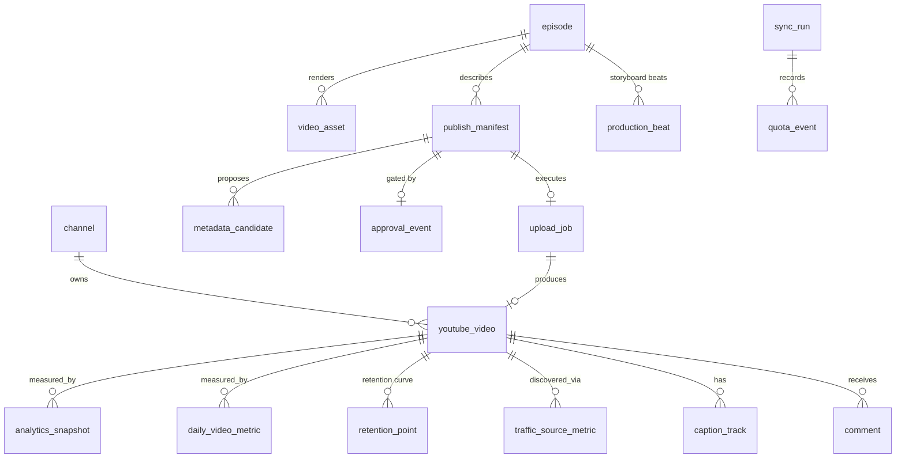

# Data Model

**SQLite**, one file, at `%LOCALAPPDATA%\BillFindsOut\control-plane.sqlite`.

SQLite because it is a single-user local system: no server, no daemon, transactional,
trivially backed up by copying one file, and directly queryable when something looks wrong.
Nothing about this workload argues for anything heavier.

Times are stored as **ISO-8601 UTC strings**. The UI renders in `Asia/Seoul`; the database
never stores a local time, because a stored local time is a bug waiting for a DST boundary.

---

## Entities

### Production side — mirrors what already exists on disk

| Table | Purpose | Key columns |
|---|---|---|
| `episode` | one per `episodes/<slug>/` | `slug` PK, `title`, `narration_duration`, `storyboard_path` |
| `video_asset` | a rendered file | `id`, `episode_slug`, `path`, **`content_hash`**, `bytes`, `duration_s`, `width`, `height`, `rendered_at` |
| `production_beat` | storyboard beats, for the retention overlay | `episode_slug`, `scene`, `beat_index`, `t_seconds`, **`ratio`** (t ÷ duration), `action` |

`content_hash` (SHA-256 of the MP4) is the idempotency anchor for the whole publishing path.
`production_beat.ratio` is precomputed so it joins directly against YouTube's
`elapsedVideoTimeRatio` without arithmetic at query time.

### Publishing side

| Table | Purpose | Key columns |
|---|---|---|
| `publish_manifest` | the versioned publish intent | `id`, `episode_slug`, `asset_id`, `schema_version`, `state`, `metadata_json`, `youtube_json`, **`metadata_hash`**, `created_at`, `updated_at` |
| `metadata_candidate` | generated title/description options | `id`, `manifest_id`, `kind`, `text`, `lint_json`, `score`, `selected` |
| `approval_event` | an immutable record of consent | `id`, `manifest_id`, `approved_at`, `approved_by`, **`asset_hash`**, **`metadata_hash`**, `privacy_status`, `publish_at`, `revoked_at`, `revoked_reason` |
| `upload_job` | one attempt to put a file on YouTube | `id`, `manifest_id`, **`idempotency_key`** UNIQUE, `state`, `resumable_uri`, `bytes_sent`, `attempt`, `last_error_code`, `next_retry_at` |
| `youtube_video` | what YouTube says exists | `video_id` PK, `channel_id`, `manifest_id`, `title`, `privacy_status`, `publish_at`, `upload_status`, `processing_status`, `rejection_reason`, `published_at`, `last_synced_at` |
| `caption_track` | uploaded caption tracks | `id`, `video_id`, `language`, `name`, `source_path`, `youtube_caption_id` |
| `playlist` / `playlist_membership` | series organisation | `playlist_id`, `title` / `playlist_id`, `video_id`, `position` |

`approval_event` stores the **hashes that were approved**, not a boolean. That is what makes
"the approval is invalidated if the asset or metadata changes" a checkable fact rather than a
promise — see [UPLOAD_AND_SCHEDULING.md](./UPLOAD_AND_SCHEDULING.md).

### Analytics side

| Table | Purpose | Key columns |
|---|---|---|
| `analytics_snapshot` | a point-in-time capture | `id`, `video_id`, `checkpoint` (`1h`…`7d`), `requested_at`, **`data_end_date`**, `availability`, `metrics_json` |
| `daily_video_metric` | per video per day | `video_id`, `date`, `views`, `engaged_views`, `estimated_minutes_watched`, `average_view_duration`, `average_view_percentage`, `likes`, `comments`, `shares`, `subscribers_gained`, `subscribers_lost` — PK `(video_id, date)` |
| `retention_point` | the 100-point curve | `video_id`, `elapsed_ratio`, `audience_watch_ratio`, `relative_retention_performance`, `captured_at` — PK `(video_id, elapsed_ratio, captured_at)` |
| `traffic_source_metric` | discovery breakdown | `video_id`, `date`, `source_type`, `views`, `estimated_minutes_watched` |

`views` and `engaged_views` are **separate columns and never interchangeable**. Since the
July 2025 change, Shorts `views` counts every start or replay with no minimum watch time,
while `engagedViews` counts views past the initial seconds. Collapsing them would silently
corrupt every comparison.

`data_end_date` is stored because Analytics lags. A snapshot labelled "24h" whose data only
runs to yesterday must say so rather than imply the number is final.

### Operations

| Table | Purpose |
|---|---|
| `oauth_account` | which Google account is connected, granted scopes, `last_refresh_at`. **Never the tokens** — those live in DPAPI storage. |
| `sync_run` | one background sync: `kind`, `started_at`, `finished_at`, `status`, `error_code`, `items_processed` |
| `quota_event` | `method`, `bucket`, `cost`, `ok`, `ms`, `at` — the persistent quota ledger |
| `experiment_annotation` | free-text creative notes attached to a video or a date range, for later comparison |

---

## Retention data and Google's caching rules

The API Services Terms constrain how long API data may be stored. Practical rules adopted:

- **Aggregated metrics** (`daily_video_metric`, `retention_point`) are our own derived
  performance record and are retained for the life of the channel.
- **Raw API response bodies are NOT archived by default.** They are kept only for the
  duration of a `sync_run` for debugging, then dropped. Storing raw responses indefinitely
  is the pattern most likely to breach the storage rules, and it buys us nothing.
- **Author-attributed comment content** is refreshed on read rather than treated as a
  permanent local archive, and is deleted locally when it disappears upstream.
- Any cached YouTube metadata (titles, descriptions) is **refreshed at least every 30 days**,
  which is the conventional reading of the Terms' requirement to keep stored API data current.

See [API_POLICY_AND_LIMITS.md](./API_POLICY_AND_LIMITS.md).

---

## Migrations

Plain numbered SQL files applied in order, with a `schema_migration` table recording what has
run. No ORM, no migration framework. For a single-file local database, an ORM's abstraction
costs more than it saves and hides the exact SQL when a query is slow.
