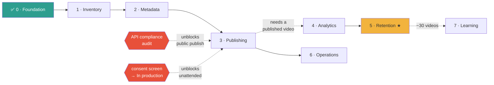

# Implementation Roadmap

Ordered by **evidence**, not by the order the domains were described. Two reorderings are
deliberate and argued below.

Effort is one focused developer-day unless stated.

---

## Phase 0 — Foundation ✅ **DONE**

| Delivered | |
|---|---|
| OAuth: installed-app, PKCE, loopback, Chrome | `src/youtube/auth.mjs` |
| DPAPI-encrypted token storage outside the repo | `src/youtube/token-store.mjs` |
| REST adapters + quota ledger + error normalisation | `src/youtube/api.mjs` |
| Read-only live verification | `tools/youtube-doctor.mjs` |
| Anti-AI copy linter, proven on real episode data | `src/youtube/metadata/` |

Gates A, B, C proven against the live channel. **Value: the risky unknowns are now known.**

---

## Phase 1 — Inventory and dashboard · 2 days

**Depends on:** Phase 0. **Risk:** low.

- SQLite schema + migrations ([DATA_MODEL.md](./DATA_MODEL.md))
- channel sync → `channel`, `youtube_video`
- inventory sync via uploads playlist + `videos.batchGetStats`
- ingest `episodes/*/storyboard.json` → `production_beat` with precomputed `ratio`
- loopback backend (`127.0.0.1:8787`) + Dashboard and Videos pages
- persistent quota ledger, OAuth health, sync status

**Value:** the channel becomes visible locally, and the production↔YouTube link exists before
there is any data to hang on it.

> ⚠️ The channel currently has **0 videos**. This phase is built against an empty channel and
> will show empty states. That is correct, and building it now means the moment the first
> video publishes, everything downstream already works.

---

## Phase 2 — Metadata studio · 2 days

**Moved ahead of upload. Reason:** nothing can be uploaded until metadata exists and has been
approved, and the linter is already built and proven. Doing this first means the first upload
is a *good* upload rather than a placeholder to be fixed later.

- candidate generation from `episode.json` + transcript + storyboard
- linting and ranking (built) wired to the UI
- `publish_manifest` schema + validation
- approval flow recording `asset_hash` + `metadata_hash`
- phrase/fingerprint history seeded from the batch

**Depends on:** Phase 1 (needs `episode`, `video_asset`). **Risk:** low — no writes to Google.

---

## Phase 3 — Publishing · 3 days

**Depends on:** Phase 2. **Risk: HIGH — first write path.**

- resumable upload with session persistence and offset resume
- idempotency: unique key, pre-flight duplicate check, single-flight claim
- `captions.insert` from our existing SRT (high value, already produced)
- `thumbnails.set`, `playlistItems.insert`
- `publishAt` scheduling with dual-timezone confirmation
- processing/rejection polling

**Blocked at the last step by the audit gate.** Everything up to `UPLOADED_PRIVATE` works;
publication is finished by hand until an audit passes.

> **First upload must use a disposable test asset**, never one of the ten production videos,
> and needs explicit written authorisation. See [Phase 35 rule](./ARCHITECTURE.md).

---

## Phase 4 — Analytics · 2 days

**Depends on:** ≥1 published video with real traffic. **Risk:** low technically; gated by data.

- report-definition catalogue + validation
- `daily_video_metric` backfill and incremental sync
- snapshots at 1h/6h/24h/72h/7d with `data_end_date` and refreshability
- Video Detail page: views **and** engagedViews side by side, with definitions

---

## Phase 5 — Retention overlay · 1.5 days

**Depends on:** Phase 4 + a video with enough watch data. **Risk:** low. **Value: highest in
the whole roadmap.**

- `video.retention` query → `retention_point`
- join `production_beat.ratio` against `elapsedVideoTimeRatio`
- retention viewer with beat annotations
- `relativeRetentionPerformance` for cross-video comparison

This is the feedback loop closing. Everything before it is plumbing that makes it possible.

---

## Phase 6 — Operations · 2 days

**Depends on:** Phase 3. **Risk:** low.

- comment inbox with filters; **AI drafts, human sends** — no auto-reply
- traffic-source reports
- job queue UI, missed-job detection, loud SCHEDULER OFFLINE state
- `youtube:disconnect` — revoke token and drop YouTube-derived tables

---

## Phase 7 — Learning · open-ended

**Depends on:** 20–30 published videos. **Risk:** the temptation to over-model.

- experiment annotations, batch comparison, retention-shape clustering by beat structure

> **Do not build predictive ML.** With 10–30 videos there is no dataset. Early value comes
> from correct uploads, consistent metadata, reliable scheduling and *visible* retention —
> not from a model fitted to noise. Revisit past ~100 videos, and even then only descriptively.

---

## Deferred, with reasons

| Item | Why not now |
|---|---|
| **Reporting API** | Bulk CSV infrastructure for a 0-video channel. Revisit at ~100 videos |
| **Public research lane** | 100 `search.list` calls/day is scarce; no value until we have our own baseline |
| **Playlist auto-creation** | Series structure is an editorial decision. Capability designed, not automated |
| **Channel branding via API** | Needs the broad `youtube` scope for a one-off cosmetic edit. Do it by hand |
| **Local upload timer** | YouTube-side `publishAt` is strictly better; build only if bandwidth scheduling is genuinely wanted |

---

## Critical path

The two red boxes are **Cloud Console actions a human must take**. Neither blocks Phases 1–2.

## Two actions worth doing today

1. **Set the consent screen to "In production."** One click. Without it, refresh tokens die
   every 7 days and unattended scheduling is impossible.
2. **Publish one video by hand.** Every analytics phase is gated on real data existing, and
   the channel has none. One published Short unblocks Phases 4 and 5 entirely.
