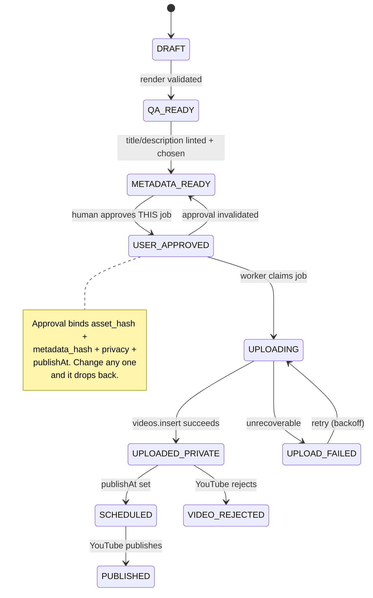
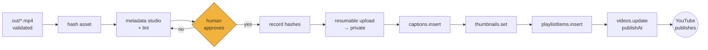

# Upload and Scheduling

How a rendered MP4 becomes a scheduled YouTube video, and every way that can go wrong.

> ⚠️ **Gate E is currently closed.** Project `sage-momentum-425811-f3` must be assumed
> unaudited, so every `videos.insert` upload is **permanently private** and `publishAt`
> cannot override it. The pipeline below is correct and worth building; its last step is
> blocked until an API compliance audit passes. See
> [SMOKE_TEST_REPORT.md](./SMOKE_TEST_REPORT.md).

---

## State machine

Approval is a gate, not a checkbox.



### What approval actually means

An approval authorises **one exact job**, never a policy. `approval_event` records:

- `asset_hash` — SHA-256 of the exact MP4
- `metadata_hash` — hash of title + description + tags + category + language
- `privacy_status` and `publish_at` as approved

Before the worker uploads, it **recomputes both hashes and compares**. Any mismatch →
`APPROVAL_INVALIDATED`, state falls back to `METADATA_READY`, and a human is asked again.

This is why the approval stores hashes rather than a boolean. A boolean cannot tell you the
title changed after it was ticked.

**Visibility is never changed without explicit human intent.** No automation path sets a
video public, ever. Publication happens either by YouTube honouring a `publishAt` a human
approved, or by a human acting in Studio.

---

## Idempotency

Duplicate uploads are the expensive failure — they burn one of only **100 `videos.insert`
calls per day** and put a stray video on the channel.

Defence, in layers:

1. **`idempotency_key`** = `sha256(asset_hash + metadata_hash + publishAt)`, UNIQUE on
   `upload_job`. A second insert with the same key fails at the database, not at Google.
2. **Pre-flight check** — before starting, look for an existing `youtube_video` row with the
   same `asset_hash`. If one exists → `UPLOAD_DUPLICATE`, refuse, show the existing video.
3. **Resumable session reuse** — a crashed job stores its `resumable_uri`. On restart the
   worker queries the session's byte offset and continues, rather than starting a new upload.
4. **Single-flight worker claim** — a job row is claimed in a transaction, so a double-click
   or two worker ticks cannot both take it.

## Resumable upload

`videos.insert` with `uploadType=resumable`:

1. `POST` metadata → Google returns a session URI
2. persist the URI on the job **before sending a single byte**
3. `PUT` the file in chunks (8 MB), recording `bytes_sent`
4. on interruption, `PUT` with `Content-Range: bytes */<size>` to ask the offset, then resume
5. on `200`/`201`, capture the video ID

| Failure | Handling |
|---|---|
| network drop | resume from the queried offset |
| access token expires mid-upload | `google-auth-library` refreshes; the session URI stays valid |
| `5xx` | exponential backoff, capped, retry |
| `404` on the session | session expired (~1 week) — start a new one, same idempotency key |
| quota exhausted | **do not retry today**; surface `QUOTA_EXCEEDED` with the PT reset time |
| process crash | job row survives; the worker resumes on next start |

Retryable and non-retryable are treated differently on purpose. Retrying `SCOPE_MISSING` or
`QUOTA_EXCEEDED` just burns budget on an outcome that cannot change.

---

## Scheduling — two mechanisms, one strongly preferred

### A. YouTube-owned schedule ✅ preferred

Upload now as `private`, set `status.publishAt` to a future RFC-3339 UTC instant. YouTube
owns publication from then on.

**It works with this machine switched off.** That single property is why it wins.

Requirements: `privacyStatus` must be `private`; `publishAt` must be in the future. Setting
it after upload costs a `videos.update` (50 units) — cheap enough, and worth batching.

### B. Local queue ⚠️ optional, and honest about its weakness

"Upload this file tomorrow at 10:00" needs our worker running at 10:00. If we build it:

- jobs persist with `fire_at`
- on startup the worker detects jobs whose `fire_at` has passed → `MISSED_LOCAL_JOB`, shown
  loudly, never silently skipped
- the dashboard shows **SCHEDULER OFFLINE** whenever the app is not running

Use B only to control *when the upload happens* (bandwidth, batching). Use A to control
*when the video goes live*. A missed publication is unrecoverable in a way a delayed upload
is not.

### Timezones

Stored as UTC RFC-3339. Entered and displayed in `Asia/Seoul` by default. **Both are always
shown together** at the approval step:

```
Publish  Tue 26 Aug 2026, 19:00  (Asia/Seoul)
         2026-08-26T10:00:00Z    (UTC — what YouTube receives)
```

Ambiguity here produces a video that goes live twelve hours early, so the UI never shows one
without the other.

---

## Publish manifest

Versioned, schema-validated on read and write. `schema_version` is present from v1 so a later
field addition does not require guessing what an old row meant.

```jsonc
{
  "schemaVersion": 1,
  "contentId": "airplane-window-hole",
  "asset": {
    "videoPath": "out/batch-001/01-airplane-window-hole.mp4",
    "contentHash": "sha256:…",
    "durationSeconds": 27.9,
    "width": 1080, "height": 1920
  },
  "thumbnailPath": "output/thumbnails/01.png",
  "captions": [
    { "language": "en", "path": "episodes/airplane-window-hole/captions.en.srt", "isDraft": false }
  ],
  "metadata": {
    "titleCandidates": [ { "text": "…", "score": 0.93, "lint": { "errors": 0, "warnings": 0 } } ],
    "selectedTitle": "The Hole in Your Airplane Window Isn't a Defect",
    "description": "…",
    "tags": ["airplane window", "aviation", "how things work"],
    "categoryId": "27",
    "defaultLanguage": "en",
    "defaultAudioLanguage": "en"
  },
  "youtube": {
    "privacyStatus": "private",
    "publishAt": "2026-08-26T10:00:00Z",
    "publishAtLocal": "2026-08-26T19:00:00+09:00",
    "playlistIds": [],
    "madeForKids": false,
    "containsSyntheticMedia": null       // ← deliberately null. See below.
  },
  "approval": {
    "status": "USER_APPROVED",
    "approvedAt": "2026-08-25T09:12:00Z",
    "assetHash": "sha256:…",
    "metadataHash": "sha256:…"
  }
}
```

### `containsSyntheticMedia` is deliberately `null`

Not `false`, and never auto-filled.

YouTube requires disclosure when content is **realistic** and synthetically generated or
altered in a way that could mislead a viewer about real events, places or people. These
videos are hand-authored vector doodles — plainly non-realistic — with a synthesised
narration voice.

That is a judgement about a specific policy applied to specific content, and it belongs to
the creator. The manifest therefore **requires an explicit choice before approval** rather
than defaulting either way. A default of `false` would be an automated legal-ish declaration
made by software; a default of `true` would be wrong and would attach a misleading label.

`madeForKids` is likewise explicit — it is a legal declaration under COPPA, not a convenience
field.

---

## Full flow



Order matters: captions, thumbnail and playlist are attached **while the video is still
private**, so nothing half-configured is ever briefly visible.

**Quota per published video:** insert 1 (own bucket) + captions 400 + thumbnail 50 +
playlist 50 + update 50 = **550 units** of the shared 10,000, plus 1 of 100 daily inserts.
Roughly 18 videos/day by units; 100/day by insert calls. Not a constraint at this scale.
